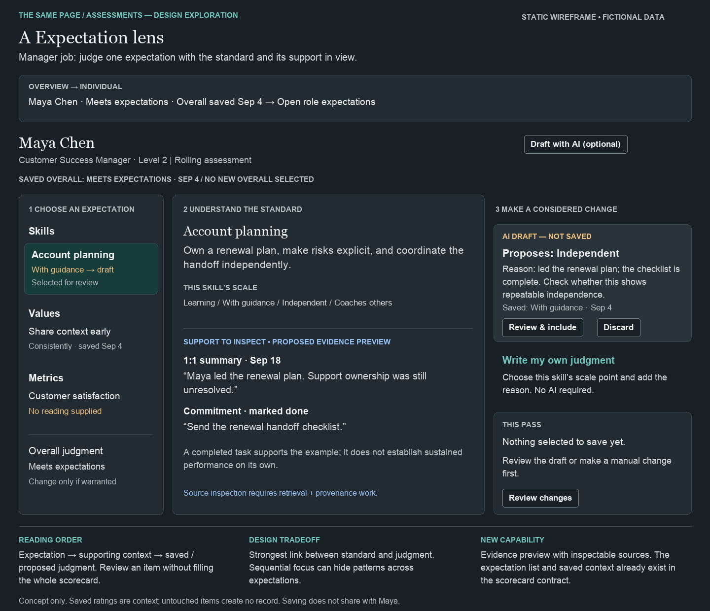
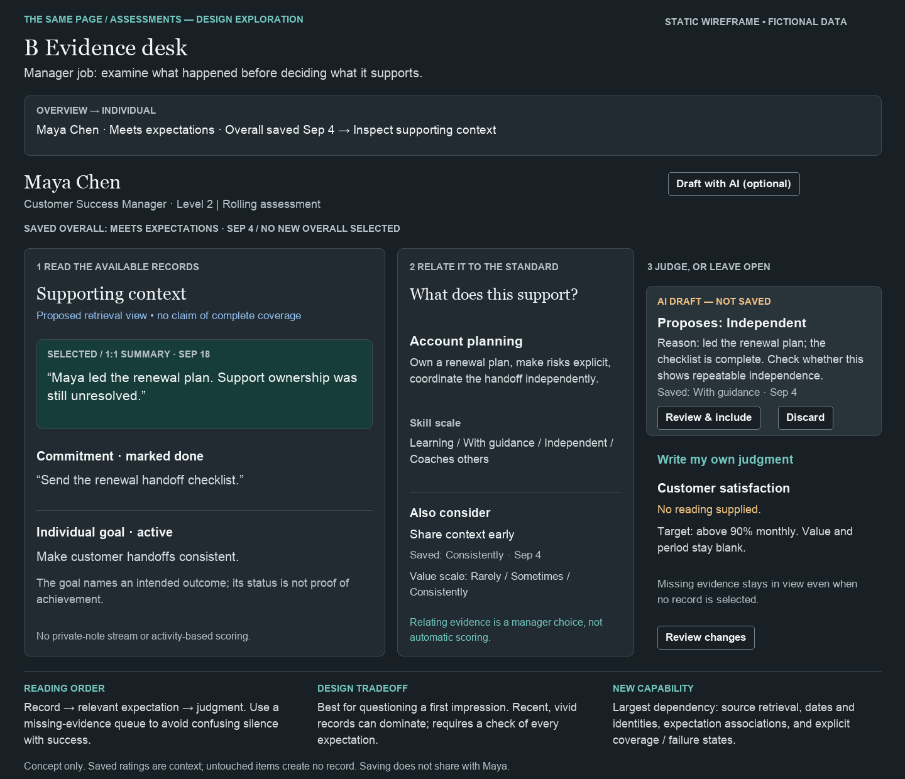
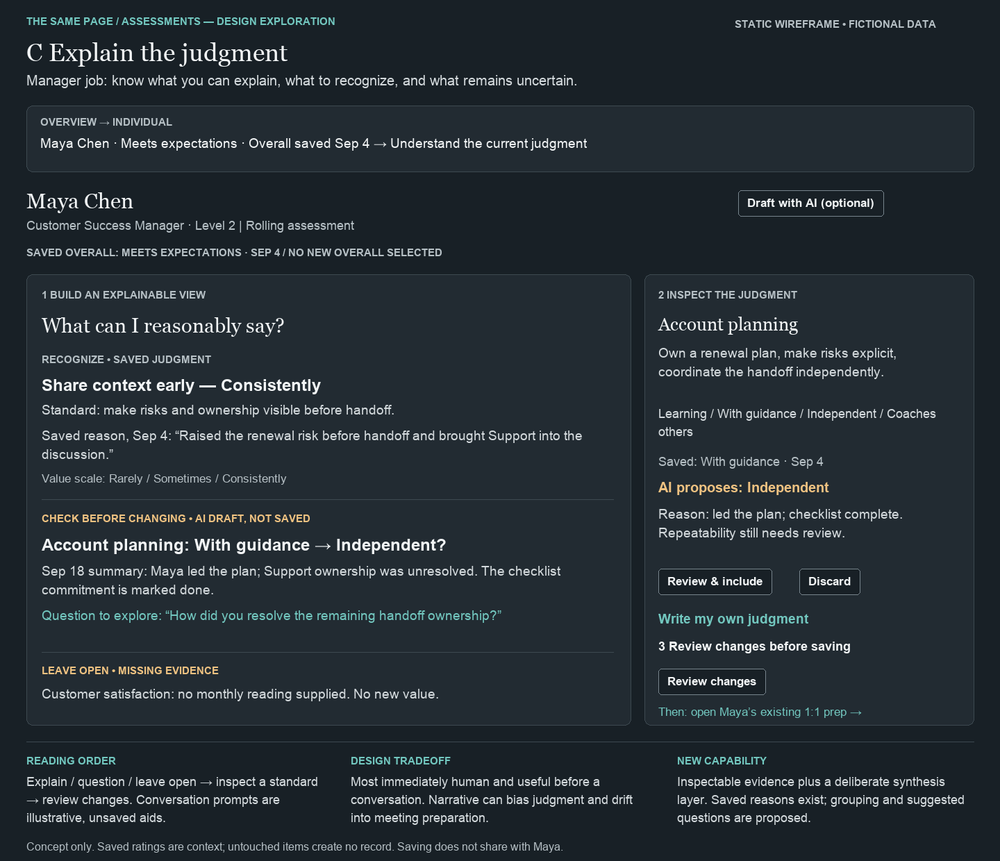

# Assessments — three directions, awaiting selection

September 25, 2026. Static wireframes only; all people, expectations, dates, judgments and evidence in the images are fictional. No application changes or working prototype. No direction selected.

## Current experience, verified

Inspected the repository overview and scorecard, assessment routes and frontend contracts, role expectations documentation, and the Relationship Desk Growth entry point. Also inspected the signed-in assessment overview and one individual scorecard read-only. Selected Goals and Relationship Desk HTML references informed hierarchy, typography and restraint, not layout.

- Assessments are rolling records. Formal `performance_reviews` remain dormant. Skills, values (including applicable organization-wide values), metrics and an independent overall judgment are supported.
- Each expectation carries its own scale definitions. Skills/values accept a scale point; metrics accept an actual value and period. Overall uses the organization’s five labeled levels, not a calculated average.
- The overview is alphabetical and shows the latest **overall** label/date. “Not yet assessed” therefore does not establish that no skill, value or metric has ever been recorded. Use “No overall judgment yet” instead. Avoid urgency or employee rankings inferred from rating or age.
- The individual page leads with overall rating, then skills, values and metrics. Existing ratings are read-only context and pending inputs start empty. Saving filters out untouched inputs. Manual assessment is available.
- The documentation says scale-point meanings are visible; implementation and signed-in UI show numeric skill/value buttons with meanings in tooltips. The concepts put the words on screen.
- AI drafting makes no assessment writes. It populates the same pending inputs used for manual changes; the manager can edit before Save. It does not currently maintain a distinct AI proposal layer or explicit per-item inclusion workflow. The concepts add that separation.
- The prompt permits omitted items and null overall. A wholly empty draft gets an insufficient-evidence message; a partially omitted item has no explicit explanation. Omission must not automatically be relabeled “insufficient evidence”: it could be unreviewed, unsupported or unavailable.
- The Relationship Desk’s Growth view has a read-only overall summary and an assessment link. Its percentage ring is an ordinal divided by the maximum ordinal, not a measured performance percentage. These concepts use the label/date instead. Development remains on Growth; 1:1 preparation stays in its existing workspace.

## What evidence exists where

| Layer | Available now | Design consequence |
|---|---|---|
| Assessment interface | Expectations, existing score/date or metric value/period, editable draft reasons | There is no inspectable source-evidence panel. Existing skill/value and overall reasons are returned by the API but not displayed as saved context. |
| Scorecard contract | Configured scales, latest item records with skill/value notes, overall notes | Expose existing reasons and scale meanings without claiming new evidence retrieval. Metric entries have no saved source-notes field in this contract. |
| AI draft input | Up to five non-null 1:1 summaries; latest 20 relevant manager-owned commitments, split into open and up to five completed; individual goal titles/status/success metrics | This is bounded context, not a comprehensive history or an evidence audit. Goal check-in readings, private notes, documents and employee self-assessments are not included by this route. |
| AI draft output | Proposed ratings/values and free-text reasons | No source IDs, citations, per-item coverage report or structured confidence. Dates/IDs for 1:1 summaries are not passed through into the prompt as provenance. |
| Proposed evidence layer | Record excerpts, source identity/date, mapping to expectations, explicit unavailable/empty states | All three mockups label this dependency. No invented source URLs or working links are supplied. A missing source response must never appear as “no evidence.” |

The metric draft includes notes, but the frontend save payload and metric save model omit them. These concepts must not suggest that metric provenance already persists.

## Sharpened question

**What can I reasonably say about this person against the role’s expectations, what is still uncertain, and what should we discuss?**

“Fair” is a desired quality, not something the interface can certify. Show the standard, the scope and limitations of the support, and the manager’s reasoning. A missing reading is a gap in knowledge, not a negative judgment.

## Shared fictional example

Maya Chen, Customer Success Manager, Level 2. Saved overall: Meets expectations, September 4; no new overall selected.

- **Skill — Account planning:** own a renewal plan, make risks explicit, coordinate handoff independently. Scale: Learning / With guidance / Independent / Coaches others. Saved: With guidance, September 4. AI proposes Independent, still awaiting review.
- **Value — Share context early:** make risks and ownership visible before handoff. Scale: Rarely / Sometimes / Consistently. Saved: Consistently, September 4. Saved reason: “Raised the renewal risk before handoff and brought Support into the discussion.” No proposed change.
- **Metric — Customer satisfaction:** above 90% monthly. No reading supplied; value and period remain blank. Display this metric’s configured quantitative scale when opened; do not reuse the skill scale or invent a reading.
- **Supporting context:** September 18 summary: “Maya led the renewal plan. Support ownership was still unresolved.” Completed commitment: “Send the renewal handoff checklist.” Active goal: “Make customer handoffs consistent.” Completion/status alone does not justify a rating.

Each screen shows a different selection of the same fixture, not different evidence or judgments. Overall remains independently editable against its own labels, never derived from the other items.

## A — Expectation lens (recommended)

Prioritizes a defensible judgment against a clear standard. Select an expectation, read its meaning and support, compare the saved judgment with a proposed change. Manual entry opens that item’s scale and reason; reviewing an AI draft lets the manager edit and explicitly include it. Review changes presents only included or manually entered changes before confirmation. Untouched saved ratings are never logged again.

Overview: searchable people, saved overall label/date and “No overall judgment yet” filter; person selection opens the expectation navigator. A later item-coverage summary could expose unrecorded expectations, but requires aggregation beyond the current overview contract. No missing-evidence counts or persistent-draft badges are assumed today.

**Benefit:** the role standard anchors the decision, while the navigator keeps gaps visible. **Tradeoff:** slower to see patterns spanning expectations. **Dependency:** source inspection and attribution for the evidence pane; distinct proposal/inclusion state. Existing expectations, scales and saved reasons already support much of the arrangement.

## B — Evidence desk

Prioritizes examining observations before relating them to a standard. Select a record, consider which expectation it supports, then judge or leave open. Association is a considered manager action, not an automatic rating. Always offer a pass through expectations with no inspected support.

Overview: the same honest people list, leading to “Inspect supporting context.” Source-type/date filters live inside the individual evidence desk. A team-level “new evidence” inbox is a separate capability, not a current feature.

**Benefit:** makes it easier to question an initial impression or see contradictory context. **Tradeoff:** abundant or recent documentation can dominate; sparse documentation can be mistaken for poor performance. **Dependency:** greatest retrieval/provenance scope, record-to-expectation associations, and explicit retrieval coverage/failure states, plus separate AI proposal review.

## C — Explain the judgment

Prioritizes understanding what the manager can explain. Read saved recognition, an unresolved proposed change and a missing reading; inspect the underlying standard and judgment alongside. The illustrative question is an unsaved thinking aid, not an agenda or employee-facing message.

Overview: select a person’s current judgment to understand its rationale. Connections from Relationship Desk → Growth land here naturally. After reviewing/saving changes, open the existing 1:1 prep workspace; no automatic transfer, sharing or duplicate prep editor.

**Benefit:** the most human and immediately useful account of the assessment. **Tradeoff:** narrative may anchor the manager before they inspect the evidence; overlaps most with preparation. **Dependency:** a synthesis/grouping layer plus inspectable evidence and explicit review of any generated language.

## Recommendation

Choose **A, Expectation lens**, as the organizing direction. It keeps the standard, supporting context and manager judgment closest together and fits the rolling model without turning the page into a recurring review ritual. Keep C’s emphasis on explainability as a quality bar for the saved reason, rather than a second workspace. Choose B instead only if inspecting and relating source records is the primary job you want Assessments to own.

All three images were visually checked; a wrapped heading was corrected. Decision remains with Andrew. No implementation plan, commits, pushes or deployment were produced.
